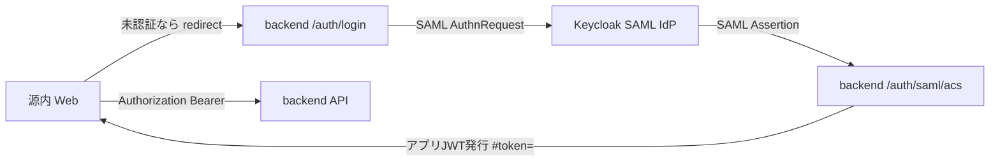
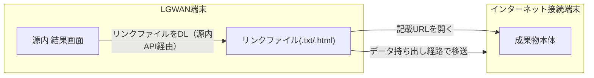

# Open GENAI


デジタル庁がオープンソースで公開したガバメント AI「源内（GENAI）」を、
**完全ローカル環境 × ローカル LLM（OpenAI 互換 API）** で動かすためのプロジェクトです。

> **バージョン:** 現在 **v0.3.1**（起動手順・CI・添付拡張子判定の修正）。v0.3.0 = 画像生成の源内一本化・アプリピン留め・LGWAN 成果物キャリア配信、v0.2.1 = セキュリティ・品質保証、v0.2.0 = 自治体・閉域向け拡張、v0.1.0 = ローカル源内化の第一段階。
> 変更履歴は [CHANGELOG.md](CHANGELOG.md) を参照。

> **免責 / Disclaimer**: 本リポジトリは有志による**非公式フォーク**です。デジタル庁とは一切関係がなく、
> 同庁による承認・支援を受けたものではありません。`genai-web/` はデジタル庁の
> [digital-go-jp/genai-web](https://github.com/digital-go-jp/genai-web)（MIT ライセンス）を
> ローカル動作向けに改変して同梱しています（原 LICENSE は `genai-web/LICENSE` に保持）。
> デジタル庁オリジナルの `genai-ai-api` は本リポジトリには含めていません（必要な場合は
> [digital-go-jp/genai-ai-api](https://github.com/digital-go-jp/genai-ai-api) を別途取得してください）。

ホスト OS / ハードウェアは特定環境に依存しません。macOS (Apple Silicon) でも、
Linux + NVIDIA GPU 機（例: **NVIDIA DGX Spark**）でも動作します。

源内はもともと AWS / Azure / Google Cloud などのクラウド前提
（Amazon Cognito 認証・Lambda・Bedrock 等）で作られているため、そのままでは
ローカルで動きません。本プロジェクトは以下を行うことでローカル完結させます。

- 認証（SAML）を **ローカル完結**（`backend` を SAML SP、`Keycloak` を SAML IdP として実装）
- LLM 呼び出しを **OpenAI 互換 API** 経由で行う（既定は Ollama の `/v1`。vLLM / LM Studio / OpenAI など任意の OpenAI 互換サーバに切替可）
- クラウド API（チャット履歴・推論ストリーム）を **ローカルバックエンド（FastAPI）** で代替

```
[ブラウザ] ──▶ proxy (nginx :80) ──▶ web (源内 Web / Vite)
                  │                    REST + ストリーミング
                  ├──▶ backend (FastAPI) ──▶ OpenAI 互換 LLM（Ollama 等）
                  └──▶ keycloak (/kc)      SAML IdP
```

本番は `docker-compose.prod.yml` で TLS(443) 終端。閉域検証は HTTP(80) のみ（`docker-compose.verify.yml`）。SeaweedFS（8333）は本番 compose ではホスト非公開で、成果物のダウンロードは `S3_PUBLIC_ENDPOINT` 経由のリバースプロキシを別途用意します（詳細は「成果物ファイル」節）。

> **変更履歴:** [CHANGELOG.md](CHANGELOG.md)（**v0.3.1** = 起動手順・CI・添付拡張子判定の修正、**v0.3.0** = 画像生成の源内一本化・アプリピン留め・LGWAN 成果物キャリア配信、**v0.2.1** = セキュリティ・品質保証、**v0.2.0** = 自治体・閉域向け拡張、**v0.1.0** = ローカル源内化）

## 設計思想：自治体・閉域運用への拡張

初期リリースでは「源内のクラウド依存を OSS／ローカルに置き換える」ことに集中していました。
その後、**実際の自治体（閉域・LGWAN 等）で使う**ことを想定し、思想と構成を大きく広げています。
改修の多くは **OpenGENAI レイヤ**（`backend/` と各 exApp）に集約し、上流の `genai-web` は
極力無改修のままにしています（マージ容易性・源内 UX の維持）。

### なぜ思想を変えたか

| 課題 | 方針 |
| --- | --- |
| 監査・権限・データ削除など、クラウド版が暗黙に担っていたガバナンス | マネージドサービスに頼らず **自前実装**（監査ログ・モデル制御・入力制限・契約終了時削除） |
| 組織の実態（課・横断プロジェクト）と源内のチームモデルのギャップ | **チーム主体・非階層**に整理。1 人が **複数チームに所属**できるよう拡張 |
| 管理機能を Keycloak コンソールだけに頼る運用負荷 | 管理者向け機能を **源内 UI 内の exApp** として提供（一般利用者には非表示） |
| Dify 等の第三者 URL をそのまま利用者に渡すリスク | **自前 S3 互換（SeaweedFS）** へ再ホストし、署名付き URL で受け渡し |
| 各コンテナを個別ポート公開する開発構成 | **nginx 単一入口**に統一（本番 TLS・閉域 HTTP 検証） |

### 4 つの柱

1. **自治体実務を想定した機能** — 監査ログ（3 年以上保持）、利用者 CSV 一括管理、モデル利用制御、禁止語／個人情報検査、プロンプトテンプレート、契約終了時の完全削除と報告書生成
2. **チーム主体・複数所属** — 親子階層のないフラットなチーム。利用者は複数チームに所属可能。AI アプリ・RAG ナレッジ・保存プロンプトの共有は **所属チーム** を軸に制御
3. **源内 UI 制約の opt-in 拡張** — Form Spec v1（条件表示・リアクティブフォーム・プレビュー）、`dynamic_schema` による動的フォーム、各画面の折りたたみヘルプ。既存 exApp は無改修で従来どおり動作
4. **成果物のオブジェクトストレージ** — AI アプリ（Dify 等）が生成したファイルを SeaweedFS に保存し、backend 経由で署名付き URL を提示

## 構成

| ディレクトリ | 内容 |
| --- | --- |
| `genai-web/` | デジタル庁 源内 Web（フォーク + ローカル化パッチ。同梱） |
| `backend/` | ローカル LLM 用の代替バックエンド（FastAPI / Team API も兼ねる） |
| `rag-app/` | RAG を「行政実務用 AI アプリ」として提供するマイクロサービス（FastAPI） |
| `whisper-app/` | 文字起こしを「AI アプリ」として提供（faster-whisper / CPU） |
| `dify-app/` | 外部 Dify（ワークフロー / チャットフロー）を「AI アプリ」として連携する汎用プロキシ（FastAPI） |
| `shared/` | 共用モジュール（`docextract.py` ドキュメント抽出、`ssrfguard.py` SSRF 対策） |
| `audit-app/` | 監査ログ参照（管理者限定 exApp） |
| `usermgmt-app/` | 利用者 CSV 一括管理（Keycloak Admin API、管理者限定 exApp） |
| `modelpolicy-app/` | モデル利用制御ポリシー管理（管理者限定 exApp） |
| `ngword-app/` | 禁止語・個人情報パターン管理（管理者限定 exApp） |
| `prompt-app/` | プロンプトテンプレートカタログ（標準／個人／グループ共有） |
| `seaweedfs/` | 成果物配信用 S3 互換ストレージ設定 |
| `scripts/` | 運用スクリプト（契約終了時の完全削除・報告書生成 等） |
| `docker-compose.yml` | proxy + web / backend / … をまとめて起動（HTTP :80 のみ公開） |
| `docker-compose.prod.yml` | 本番 TLS 構成（proxy :80/:443 のみ公開） |
| `docker-compose.verify.yml` | 本番スタックの HTTP 検証用オーバーライド（自己署名不要） |
| `proxy/` | nginx リバースプロキシ設定（`nginx.http.conf` / `nginx.conf`）。成果物ファイル（SeaweedFS）用の別経路は README「成果物ファイル」節を参照 |

## オリジナル源内からの改修内容（クラウド依存 → オープンアーキテクチャ）

このプロジェクトの中心的な改修は、**源内が依存するクラウドのマネージドサービスを、すべてオープンソース/ローカルの仕組みに置き換える**ことです。置換の全体像は次のとおりです。

| 機能 | 源内オリジナル（クラウド・マネージド） | Open GENAI（オープン/ローカル置換） |
| --- | --- | --- |
| 認証 | Amazon Cognito（SAML は Cognito がブローカー） | **Keycloak**（SAML IdP）＋ `backend`（SAML SP, `python3-saml`）＋ アプリ JWT |
| API 認可 | API Gateway Authorizer / IAM | `backend` の **JWT 検証ミドルウェア** |
| LLM 推論 | Amazon Bedrock | **OpenAI 互換 API**（既定は Ollama の `/v1`。任意の互換サーバに切替可） |
| 推論ストリーム | Lambda `InvokeWithResponseStream`（Cognito Identity Pool 資格情報で直接呼び出し） | `backend` の **HTTP ストリーミング** `/predict/stream` |
| チャット履歴 | Amazon DynamoDB | **SQLite**（`backend`） |
| 保存プロンプト（systemcontexts） | Amazon DynamoDB | **SQLite**（`backend`） |
| チーム / メンバー / AI アプリ管理 | DynamoDB ＋ Cognito グループ | **SQLite** ＋ Keycloak グループ ＋ `team_users.isAdmin` |
| ファイル添付ストレージ | Amazon S3（署名付き URL） | チャット添付は `backend` **ローカル保存**。AI アプリ成果物は **SeaweedFS（S3 互換）** へ再ホストし署名付き URL で配信 |
| RAG（ベクトル検索・埋め込み） | OpenSearch / Bedrock Knowledge Base | **Qdrant** ＋ Ollama `mxbai-embed-large`（`rag-app` として） |
| 文字起こし | Amazon Transcribe ＋ S3 | **faster-whisper**（`whisper-app` を AI アプリとして） |
| 画像生成 | Amazon Bedrock（画像モデル） | **源内 Web `/image`** + ホスト **Stable Diffusion**（A1111 互換、`backend/image_gen.py` 経由） |
| ドキュメント読取（PDF 等） | Bedrock の document 入力 | **テキスト抽出**（pypdf / python-docx / openpyxl, `shared/docextract.py`） |

### 追加したコンポーネント（すべてオープンソース）

- `backend/`（FastAPI）: 源内 Web が叩くクラウド API（genU API / Team API / 推論ストリーム）を代替。SAML SP・JWT 発行/検証・ファイル保存も担当
- `rag-app/`（FastAPI）: RAG を源内の作法どおり「行政実務用 AI アプリ（exApp）」として提供
- `keycloak`（SAML IdP・ユーザー管理）/ `qdrant`（ベクトル DB）を `docker-compose.yml` に追加

### OpenGENAI レイヤで追加した機能（`fc57e53` 以降）

クラウド版源内が担っていたガバナンスを、マネージドサービスなしで再実装しています。
詳細は [CHANGELOG.md](CHANGELOG.md) を参照。

| 領域 | 実装 |
| --- | --- |
| 監査ログ | `backend/app/audit.py` + `audit-app`（3 年以上保持、利用者削除と非連動） |
| 利用者管理 | `usermgmt-app`（CSV 一括作成・更新・削除） |
| モデル制御 | `backend/app/policy.py` + `modelpolicy-app`（チーム／グループ単位） |
| 入力制限 | `backend/app/ngwords.py` + `ngword-app`（禁止語・PII 正規表現） |
| プロンプト | `prompt-app`（テンプレート → チャットディープリンク） |
| 成果物配信 | `backend/app/objstore.py` + SeaweedFS（Dify 等の file artifact 再ホスト） |
| 内部認証 | 各 `app/intauth.py`（backend↔exApp 間 HMAC 署名） |
| SSRF 対策 | `shared/ssrfguard.py`（成果物取得・RAG URL 取込） |
| データ削除 | `scripts/purge-and-report.sh`（契約終了時の完全削除・報告書） |

### 源内 Web（`genai-web/`）への変更点

**クラウド SDK の差し替え**（初期ローカル化）に加え、**opt-in の UI 拡張**（自治体向け）を
最小限だけ加えています。Form Spec v1 の詳細は
[`FORM_SPEC.md`](genai-web/packages/web/src/features/exapp/FORM_SPEC.md) を参照。

- 追加: `packages/web/src/local/localAuth.ts` — ローカル SAML 認証のフロント側（JWT 取得/ログイン/サインアウト）
- 追加: `packages/web/.env.example` — ローカル向け `VITE_APP_*` の雛形（`cp .env.example .env`）
- 改修: `src/main.tsx` — Cognito/SAML ログインゲート → **ローカル SAML ログインゲート**（AWS Amplify 撤去）
- 改修: `src/hooks/useAuth.ts` — `fetchAuthSession()` → ローカル JWT デコード
- 改修: `src/lib/fetcher.ts` — Cognito トークン → **ローカル JWT を Bearer 送信**
- 改修: `src/lib/chatApi.ts` — `predictStream` を **Lambda 直接呼び出し → `/predict/stream` の fetch**
- 改修: `src/lib/fileApi.ts` — S3 URL 前提 → ローカル http URL に対応
- 改修: `src/components/ui/Header.tsx` — Amplify `useAuthenticator` → `localAuth.signOut`
- 改修: `src/features/chat/hooks/useFileUploadable.ts` — 添付可否を選択中モデルに連動
- 改修: `src/pages/SignedOutPage.tsx` — 再ログイン導線を追加
- 改修: `packages/common/src/application/model.ts` — ローカル（Ollama）モデルの定義 + `doc`（ドキュメント添付）フラグを有効化
- 改修: `packages/web/vite.config.ts` — コンテナ実行向けに `host`/ポーリング監視を設定
- 改修: `src/features/exapps/hooks/useGenUApps.ts` — クラウド依存の組み込み「文字起こし」をメニューから除外（ローカル Whisper の AI アプリで代替）
- 追加: AI アプリ ピン留め（利用者ごと・カテゴリ横断・上限8件）— トップページに「ピン留め」セクションを表示。`open-genai/` 拡張 + `LandingPage`/`ExAppList`/`ExAppListCard` の最小パッチ（[`OPENGENAI_PATCHES.md`](genai-web/OPENGENAI_PATCHES.md) 参照）
- 改修: `src/features/team-apps/utils/endpointUrl.ts` — AI アプリのエンドポイント URL 検証を `http` も許可（ローカルのコンテナ間通信 `http://dify-app:8004/invoke` 等のため。従来は `https` 必須）
- 改修: `src/features/teams/components/DialogDeleteTeam.tsx` — チーム削除時に知識ベースも消える旨の警告を追加
- 改修: 翻訳/ダイアグラム画面の説明文をローカル実態に合わせて修正
- 追加: 各画面の折りたたみ「使い方」ヘルプ（チャット・翻訳・文字起こし・文章生成・ダイアグラム・画像生成）
- 追加: 保存プロンプトの共有 UI（全体公開・所属チーム複数選択）と `/me/teams` API 連携
- 追加: exApp Form Spec v1（`visibleWhen` / `reactive` / `preview`、`/exapps/resolve`）
- 追加: `dynamic_schema: true` によるローカル exApp の動的フォーム生成（RAG 管理等）
- 改修: ダイアグラム Mermaid 抽出の堅牢化（フェンス無し出力へのフォールバック）
- 削除: `src/components/auth/AuthWithUserpool.tsx` / `AuthWithSAML.tsx`（Cognito 専用のため不要）
- 依存削除: `aws-amplify` / `@aws-amplify/ui-react` / `@aws-sdk/client-lambda` / `@aws-sdk/client-transcribe` / `@aws-sdk/credential-providers`（`packages/web/package.json`）＋ `index.css` の Amplify CSS import
- 表記修正: 翻訳画面の「AWS の Bedrock を利用」→「ローカルの LLM(Ollama) を利用」

> 注: 源内の CDK / IaC（`packages/cdk` 等）は AWS デプロイ専用のため、本プロジェクトでは使用しません（参照のみ）。

## 前提

- Docker / Docker Compose
- OpenAI 互換 API を提供できる LLM 実行環境（既定は [Ollama](https://ollama.com/)）

## 対応ホスト / GPU

LLM・画像生成（SD）は計算資源が必要です。ホスト環境ごとの推奨構成は次のとおりです。
いずれの場合も、源内 Web / backend / 各 AI アプリのコンテナ自体はどの環境でも同じように動きます。

| ホスト | LLM(Ollama) の実行 | 画像生成(SD) の実行 | 備考 |
| --- | --- | --- | --- |
| **macOS (Apple Silicon)** | **ホスト**で実行（Metal GPU で高速） | **ホスト**で実行（A1111 等） | Docker は GPU(Metal) を使えないため、GPU を使う処理はホスト側で動かし、コンテナはそれにプロキシ |
| **Linux + NVIDIA GPU（例: NVIDIA DGX Spark）** | ホスト or **コンテナ**で実行（CUDA GPU） | ホスト or **コンテナ**で実行（CUDA GPU） | [NVIDIA Container Toolkit](https://docs.nvidia.com/datacenter/cloud-native/container-toolkit/latest/install-guide.html) を入れればコンテナでも GPU 利用可 |
| その他 / CPU のみ | ホスト or コンテナ（低速） | CPU は非現実的 | 任意の OpenAI 互換サーバ（vLLM / LM Studio / OpenAI 等）に向けることも可能 |

- LLM の接続先は OpenAI 互換 API です。既定は `OLLAMA_BASE_URL`(+`/v1`)、`OPENAI_BASE_URL` で任意のサーバに切替できます（後述）。
- `host.docker.internal` は Docker Desktop（macOS/Windows）に加え、Linux でも `extra_hosts: host-gateway` で解決するよう設定済みです。
- Linux + NVIDIA でコンテナに GPU を割り当てる場合は、対象サービス（例 `ollama`）に `gpus: all`（または `deploy.resources.reservations.devices`）を追加してください（macOS 既定構成では不要なため同梱していません）。

## 使い方

### 1. Ollama を起動してモデルを取得

```bash
# ホストで Ollama を起動（インストール済みの場合）
ollama serve            # 別ターミナルで起動したままにする

# モデルを取得（日本語に強い Qwen2.5 を推奨）
ollama pull qwen2.5:7b
# 軽量に試すなら: ollama pull qwen2.5:3b  /  ollama pull qwen2.5:0.5b
```

> Ollama をコンテナで動かしたい場合は `docker compose --profile ollama up` を使い、
> `.env` の `OLLAMA_BASE_URL` を `http://ollama:11434` に変更してください。
> Linux + NVIDIA GPU（DGX Spark 等）では、`ollama` サービスに GPU を割り当てると
> コンテナのまま高速に動かせます（`NVIDIA Container Toolkit` 導入のうえ `gpus: all` を付与）。
> macOS では Docker から GPU を使えないため、Ollama は**ホスト**で動かすのが推奨です。

### 2. 設定

```bash
cp .env.example .env    # 必要に応じて DEFAULT_MODEL などを編集
```

```bash
cp genai-web/packages/web/.env.example genai-web/packages/web/.env    # 必要に応じて VITE_APP_MODEL_IDS などを編集
```

利用したいモデルを増やす場合は `genai-web/packages/web/.env` の
`VITE_APP_MODEL_IDS`（Ollama のモデル名と一致させる）を編集してください。
モデルの表示名は `genai-web/packages/common/src/application/model.ts` に定義しています。

#### LLM バックエンドの差し替え（OpenAI 互換）

LLM（チャット/RAG 生成/埋め込み）はすべて **OpenAI 互換 API** 経由で呼び出します。
既定では Ollama の `/v1`（`OLLAMA_BASE_URL` + `/v1`）を使います。
Ollama 以外（vLLM / LM Studio / OpenAI 等）に向けたい場合は `.env` で設定します。

```bash
# 例: 別の OpenAI 互換サーバに向ける
OPENAI_BASE_URL=http://host.docker.internal:8001/v1
OPENAI_API_KEY=sk-...   # サーバが要求する場合のみ
```

### 3. 起動

```bash
docker compose up --build
```

- 源内 Web: http://localhost/ （`.env` の `PROXY_HTTP_PORT` / `PUBLIC_URL` で変更可）
- バックエンド API: http://localhost/api/health
- Keycloak 管理: http://localhost/kc/

初回はフロントエンドの依存インストールに数分かかります。

> ポート 80 が使用中の場合は `.env` で `PROXY_HTTP_PORT=8080` と
> `PUBLIC_URL=http://localhost:8080` に設定してください。

## 動作確認

- http://localhost/api/health で `status: ok` と取得済みモデル一覧が返ること
- http://localhost/ を開くと Keycloak のログイン画面に遷移し、`admin` / `password` でログインできること
- 「チャット」からメッセージを送り、ローカル LLM の応答がストリーミング表示されること
- 「AIアプリ」→「**ナレッジ検索**」で質問でき、出典付きで回答されること（起動済みアプリのみ一覧に表示）
- 「翻訳」「ダイアグラムを生成」「文章を生成」がローカル LLM で動作すること
- http://localhost:8333/ をブラウザで開くと XML の `AccessDenied` が表示されること（SeaweedFS S3 API の正常応答。**開発時のみホスト公開**。本番は `S3_PUBLIC_ENDPOINT` 経由のリバースプロキシのみ公開）
- （Dify 連携）[`dify-app/dsl/File Output Test.yml`](dify-app/dsl/File Output Test.yml) をデプロイし、源内 AI アプリから実行して成果物リンクが表示されること
- http://localhost/kc/ の **Administration Console** に `.env` の `KEYCLOAK_ADMIN` でログインでき、realm **`open-genai`** の Users / Groups が表示されること（利用者アカウント管理用。源内ログイン画面とは別）

## ファイル添付（画像 / ドキュメント）

チャットでは画像とドキュメントを添付できます（モデルの対応機能フラグに応じて添付ボタンが出ます）。

### 画像（マルチモーダルモデル）

- モデル選択で **「Gemma 3 27B (ローカル・画像対応)」** を選ぶと画像添付が使えます
- 対応形式: `.jpg / .jpeg / .png / .webp`
- 画像は推論時に OpenAI 互換の **Vision 形式**（`image_url` data URL）で LLM に渡されます
- 他の画像対応モデル（例 `llava`, `llama3.2-vision` 等）も、`ollama pull` のうえ
  `genai-web/packages/web/.env` と `packages/common/src/application/model.ts` に画像フラグ付きで追加すれば利用できます

### ドキュメント（PDF / Word / Excel / テキスト）

- すべてのローカルモデルで **ドキュメント添付**が使えます（`doc` フラグを有効化済み）
- 対応形式: `.pdf / .docx / .xlsx / .txt / .md / .csv / .html / .json` など
- ローカル LLM はドキュメントを直接読めないため、**backend がテキストを抽出してプロンプトに注入**します（PDF=pypdf、Word=python-docx、Excel=openpyxl、テキスト=そのまま）
- 抽出テキストは長すぎる場合 `MAX_DOC_CHARS`（既定 30000 文字）で打ち切ります
- レガシー形式（`.doc` / `.xls` のバイナリ旧形式）はテキスト抽出に未対応です

> アップロードしたファイルは backend（`backend_data` ボリューム）に保存されます。

## 認証（SAML）

源内の SAML 認証を、ローカル完結する形で実装しています。



- `backend` が SAML SP（`python3-saml`）として動作し、検証後にアプリ JWT を発行
- `Keycloak`（`http://localhost/kc/`）が SAML IdP 兼 **利用者アカウントの台帳**
- 各 API は JWT(Bearer) で保護（未認証は 401）

### Keycloak とは（このプロジェクトでの役割）

Keycloak は **「誰がログインできるか」** を担うコンポーネントです。源内 Web そのものではなく、
ログイン画面の裏側（IdP）と、利用者アカウントの保存場所として動きます。

| Keycloak が担うこと | 源内 / backend が担うこと |
| --- | --- |
| ログイン ID（ユーザー名）・パスワード | チャット履歴・保存プロンプト |
| メールアドレス（SAML の NameID 兼利用者 ID） | チーム・メンバー・AI アプリ（SQLite） |
| 権限グループ（`SystemAdminGroup` 等） | チーム管理者（`team_users.isAdmin`） |
| SAML で backend に属性を渡す | モデル制御・入力制限・監査ログ等 |

**整理:** 利用者を「作る／止める／システム管理者にする」→ Keycloak（または後述の CSV 一括 exApp）。
「どのチームに所属させるか」→ 源内の **チーム管理** UI。

### 2 種類の画面（混同しやすい）

| URL | 用途 | ログイン |
| --- | --- | --- |
| http://localhost/kc/ | **Keycloak 管理コンソール**（運用者向け） | `.env` の `KEYCLOAK_ADMIN` / `KEYCLOAK_ADMIN_PASSWORD`（既定 `admin` / `admin`） |
| http://localhost/ | **源内 Web**（利用者向け） | realm `open-genai` の利用者（例: `admin` / `password`） |

源内にログインするときに表示される画面は Keycloak の **ログインフォーム**（realm `open-genai`）です。
管理コンソールとは別物です。

> **ログインできないとき（よくある間違い）**  
> スクリーンショットの画面（`realms/master`・Administration Console）には、源内用の **`admin` / `password` は使えません**。  
> ここは Keycloak **サーバ管理者**用で、既定は **`admin` / `admin`**（`.env` の `KEYCLOAK_ADMIN` / `KEYCLOAK_ADMIN_PASSWORD`）です。  
> `admin` / `password` は http://localhost/（源内）へのログイン用です。

### 権限グループ

realm `open-genai` には次のグループがあります（`keycloak/import/realm-open-genai.json` で初期定義）。

| グループ | 意味 | 設定方法 |
| --- | --- | --- |
| `SystemAdminGroup` | **システム管理者**。全チーム管理・管理者向け exApp（監査・利用者一括・モデル制御・入力制限等） | Keycloak 管理コンソールでユーザーをこのグループに追加 |
| `UserGroup` | **一般利用者** | 新規ユーザー作成時に付与（既定） |
| `TeamAdminGroup` | **チーム管理者**（自チームのメンバー/アプリ管理） | **Keycloak では設定しない**。源内「チーム管理」でメンバーを管理者にすると、**次回ログイン時に自動付与** |

SAML 経由で backend に渡る主な属性:

- **NameID / 利用者 ID** … メールアドレス（例: `user@example.com`）
- **groups** … 上記グループ名の一覧（カンマ区切り）

### 初期ユーザー

| ユーザー名 | パスワード | グループ | 備考 |
| --- | --- | --- | --- |
| `admin` | `password` | `SystemAdminGroup` | 源内ヘッダーに管理メニュー・管理者 exApp が表示 |
| `user` | `password` | `UserGroup` | 一般利用者 |

> 初回は Keycloak の起動に数十秒かかります。源内ログインや管理コンソールが開けない場合は少し待って再試行してください。

### Keycloak 管理コンソールの操作

1. ブラウザで http://localhost/kc/ を開く
2. **Administration Console** をクリック
3. ユーザー名 `admin`、パスワード `.env` の `KEYCLOAK_ADMIN_PASSWORD`（未設定時 `admin`）でログイン
4. 左上の realm が **`open-genai`** になっていることを確認（`master` のままだと利用者が見えません）

#### 利用者を 1 人追加する

1. 左メニュー **Users** → **Add user**
2. **Username**（必須）・**Email**（推奨: 源内の利用者 ID として使われます）・姓名を入力 → **Create**
3. **Credentials** タブ → **Set password**（**Temporary** を OFF にすると初回変更を求めません）
4. **Groups** タブ → **Join Group** → 一般利用者なら `UserGroup`、システム管理者なら `SystemAdminGroup`

#### パスワードをリセットする

1. **Users** → 対象ユーザーを開く → **Credentials** → **Set password**

#### 利用者を無効化する（削除せず止める）

1. **Users** → 対象ユーザー → **Enabled** を OFF → **Save**

#### 利用者を削除する

1. **Users** → 対象ユーザー → **Delete**

> 自己登録（Sign up）は無効です（`registrationAllowed: false`）。利用者は管理者が作成します。

#### システム管理者に昇格させる

1. **Users** → 対象ユーザー → **Groups** → **Join Group** → `SystemAdminGroup`
2. ユーザーに **再ログイン** してもらう（SAML 属性が更新されるため）

#### 源内側の設定変更時に必要な作業

`.env` の `PUBLIC_URL` を変えた場合（例: ポート 8080）は、Keycloak の SAML クライアント
（Clients → `Open GENAI SP`）の **Valid redirect URIs** / **Assertion Consumer URL** も
新しい URL に合わせる必要があります。開発用の既定 import（`keycloak/import/realm-open-genai.json`）
は `http://localhost` 前提です。

### CSV 一括管理（源内の管理者 exApp）

人数が多い場合は、Keycloak 管理コンソールの代わりに源内の **「利用者一括管理」** AI アプリ
（システム管理者のみ表示）から CSV で作成・更新・削除できます。

- ヘッダー → **AI アプリ** → **利用者一括管理（管理者限定）**
- CSV 列: `action`, `username`, `email`, `name`, `password`, `groups`, `enabled` 等
- `dry_run` で事前確認 → `apply` で Keycloak に反映

詳細は exApp フォーム内の説明を参照してください。

### 運用開始時（本番・閉域）— パスワード変更

開発用の既定パスワード（`admin`/`admin`、`admin`/`password` 等）は **そのまま運用してはいけません**。
運用開始前に、少なくとも次を変更してください。

| 対象 | 設定・操作 | 備考 |
| --- | --- | --- |
| **Keycloak サーバ管理者** | `.env.prod` の `KEYCLOAK_ADMIN_PASSWORD` | 管理コンソール（`master` realm）用。**初回起動前**に設定するのが確実（`keycloak_data` ボリューム作成後は環境変数だけでは変わらない） |
| **源内の初期利用者** | realm `open-genai` の Users でパスワード変更、または削除 | import 済みの `admin`/`user`（いずれも `password`）は検証用。本番では削除するか強固なパスワードに変更 |
| **新規利用者** | Keycloak 管理コンソール or 利用者一括管理 exApp | 実運用の利用者は CSV 一括登録等で個別パスワードを発行 |
| **backend JWT 署名** | `.env.prod` の `APP_JWT_SECRET` | Keycloak とは別だが、認証まわりで同時に変更必須 |

**初回デプロイの推奨手順:**

1. `.env.prod` で `KEYCLOAK_ADMIN_PASSWORD`・`APP_JWT_SECRET` 等を十分長い乱数に設定
2. `docker compose -f docker-compose.prod.yml --env-file .env.prod up --build` で **初回起動**（以降 `keycloak_data` に管理者パスワードが固定される）
3. 管理コンソール → realm `open-genai` → 初期ユーザー `admin`/`user` を無効化またはパスワード変更
4. 実利用者を登録（一括 exApp または Users から）

> 既に `keycloak_data` ボリューム付きで起動済みの環境で `KEYCLOAK_ADMIN_PASSWORD` だけ変えても反映されません。管理コンソールから master 管理者のパスワードを変更するか、検証環境なら `docker compose down -v` でボリュームごと再作成してください。

### Keycloak でやらないこと（源内で行う）

- **チームへの所属** … 「アカウント」→「チーム管理」でメンバー追加
- **チーム管理者の指定** … チーム管理でメンバーの管理者フラグ（Keycloak の `TeamAdminGroup` は自動）
- **AI アプリの登録** … チーム管理
- **監査ログ閲覧・モデル制御・禁止語** … 管理者 exApp（Keycloak では不可）

## RAG（AI アプリ）

源内の作法どおり、RAG を **外部マイクロサービス「行政実務用 AI アプリ」** として実装しています
（`ブラウザ → backend(Team API) → rag-app → Qdrant / Ollama`）。

使い方:
1. ヘッダーの **「AI アプリ」** を開く → **「ナレッジ検索」** を選択
2. 質問を入力して「実行」。知識ベースを検索し、**出典付き**で回答します
3. 「参照ドキュメント」に **PDF / Word(.docx) / Excel(.xlsx) / テキスト(.txt/.md/.csv 等)** を添付すると回答に利用します（テキスト抽出は `shared/docextract.py` を backend と共用）

### 知識ベースのスコープ（チーム単位で分離）

ナレッジは **チーム（＝ RAG アプリを所有するチーム）単位で分離**されます。
フォルダ階層ではなく、**タグ（フラットなラベル）** と **URL 取り込み** で整理します。

- **共通チームの RAG**: 全認証済みユーザーが使う**共有**ナレッジ
- **チーム作成時**に「検索用」「管理用」の 2 アプリを自動登録（管理用は `dynamic_schema` で動的フォーム）
- 取り込み／検索／削除はすべて、そのアプリが属するチームの `scope`（= `teamId`）内に限定
- **URL 取り込み**: 行政 HP 等の URL を登録し、定期再クロール（`URL_FETCH_ALLOWED_HOSTS` で許可ホスト制限、SSRF 対策付き）
- **タグ**: チャンクに複数タグを付与し、検索時の絞り込みに利用

### 知識ベースの管理（AIアプリのフォームから）

各チームの **「〇〇のナレッジ管理」** exApp（動的フォーム）から、検索用アプリではなく管理操作を行います。

- **添付ファイルの扱い**: 「知識ベースに登録（永続）」/「この質問だけで使う（一時）」を選べます
- **操作例**: タグ一覧、URL 取り込み／一覧／削除／再取り込み、出典削除、全消去
- **重複排除**: 同一内容のチャンクは（出典＋本文のハッシュで）重複登録されません
- 管理者操作は `SystemAdminGroup` またはチーム管理者が実行可能

知識ベースへの一括登録（CLI 例。`scope` を省略すると共通チームへ登録）:

```bash
docker compose exec rag-app sh -lc 'curl -s -X POST http://localhost:8001/ingest \
  -H "x-api-key: local-rag-key" -H "Content-Type: application/json" \
  -d "{\"scope\":\"00000000-0000-0000-0000-000000000000\",\"documents\":[{\"text\":\"登録したい本文\",\"source\":\"出典名\"}]}"'
```

- 埋め込み: Ollama `mxbai-embed-large`（`ollama pull mxbai-embed-large` が必要）
- ベクトル DB: Qdrant（`qdrant_data` ボリュームに永続化）
- 回答生成モデル: `.env` の `RAG_MODEL`（既定 `gpt-oss:20b`）

## 文字起こし / 画像生成

文字起こしは **外部マイクロサービスの「AI アプリ」**（`whisper-app`）として提供しています。  
画像生成は源内 Web の **「画像を生成」ページ**（`/image`）から利用します（`backend` の `/image/generate` がホスト SD へプロキシ）。

### UX 方針（源内組み込み vs exApp）

クラウド版源内には組み込みの「文字起こし」（`/transcribe`）と「画像を生成」（`/image`）があります。
Open GENAI では **機能ごとに入口を分けています**（どちらもローカルで動作するよう置き換え済み）。

| 機能 | Open GENAI での入口 | 理由（UX） |
| --- | --- | --- |
| **画像生成** | 源内オリジナル **`/image`** + ホスト **Stable Diffusion** | チャット連携・利用履歴・詳細設定など、源内組み込み UX を活かす。初期の SD 専用 exApp は重複のため廃止 |
| **文字起こし** | **exApp**（`whisper-app`） | 源内 `/transcribe` は Amazon Transcribe + S3 前提のためメニューから除外。ローカル Whisper を exApp として提供 |

**文字起こしで exApp を選んだ理由**

- 源内 `/transcribe` の主な差分は **話者分離（diarization）** だが、ローカルの faster-whisper では Transcribe 相当の話者認識は提供していない。**あえて外し**、言語指定・タイムスタンプ付き出力・**exApp 利用履歴**に寄せた
- 音声は exApp 実行時にコンテナ内で処理され、クラウドへ送信されない（源内 `/transcribe` のコードはリポジトリに残るが、Open GENAI では `/apps/.../whisper` から利用する）

### 文字起こし（ローカル Whisper）

- `whisper-app`（faster-whisper / CPU）。音声を添付して実行すると文字起こし（タイムスタンプ付き）を返します。
- モデルは `.env` の `WHISPER_MODEL`（既定 `medium`。`small`/`large-v3` も可）。初回実行時にモデルを取得し `whisper_cache` ボリュームにキャッシュします。
- クラウドの Amazon Transcribe + S3 への依存を置き換えています。

### 画像生成（源内 Web `/image` + Stable Diffusion）

- **AUTOMATIC1111 互換 SD サーバ**（`/sdapi/v1/txt2img`）がホストで起動している必要があります。
  - **macOS**: Docker は GPU(Metal) を使えないため、SD 本体は**ホスト**で動かします。[AUTOMATIC1111 stable-diffusion-webui](https://github.com/AUTOMATIC1111/stable-diffusion-webui) 等を `--api` 付きで `:7860` に起動してください。
  - **Linux + NVIDIA GPU（DGX Spark 等）**: SD を**コンテナでも GPU 実行**できます。`SD_API_URL` をそのコンテナのアドレスに設定してください。
- 接続先は `.env` の `SD_API_URL`（既定: ホストの `http://host.docker.internal:7860`）で変更できます。
- 検証用モック: `python3 scripts/mock-sd-server.py`（実 SD 不要でパイプライン確認）。
- 動作確認: `bash scripts/verify-image-gen.sh`

### AI アプリの表示（ヘルスチェック）

AI アプリ一覧（`/apps`）は各 exApp の `/health` を確認し、**起動していない（到達できない）アプリは自動的に一覧から隠します**。

## Dify 連携（AI アプリ）

外部の [Dify](https://dify.ai/) で作成した **ワークフロー / チャットフロー** を、源内の「AI アプリ」として呼び出せます。`dify-app` という汎用プロキシを 1 つ立て、**Dify のフローごとに「AI アプリ」を登録**する方式です（フロー単位に接続先・APIキー・種別を設定）。

```
[ブラウザ] → backend(Team API) → dify-app → 外部 Dify(/v1)
```

- `dify-app` は源内の AI アプリ・プロトコル（同期 `{inputs}` → `{outputs}`）を、Dify の API（`/v1/workflows/run` または `/v1/chat-messages`）に変換します。
- **UI は種別で出し分きます**。`dify_app_type` が `workflow` のアプリは従来の**フォーム実行型 UI**、`chat` のアプリは**対話型 UI**（吹き出し形式のチャット画面）で開きます。どちらも「AI アプリ」一覧に並びます。
- Dify の **blocking モードには既知の不具合**（1.4.1〜1.13 系で blocking 指定でも `text/event-stream` を返す）があるため、`dify-app` は常に **streaming で受信してサーバ側で集約**し、源内には同期 `outputs` として返します。
- Dify 本体は本リポジトリには含めません（**既存/外部の Dify** に接続します）。セルフホスト版は `host.docker.internal` 経由でホスト上の Dify にも接続できます。**Dify クラウド版** は `dify_base_url` に `https://api.dify.ai/v1` を指定します（後述）。
- ワークフロー用アプリとチャットフロー用アプリはエンドポイントが同じ（`dify-app`）でも問題ありません。**APIキー**（ワークフロー用 / チャット用）と `dify_app_type` で区別します。

### 登録手順（チーム管理 → アプリの作成）

ヘッダー右上「アカウント」→「チーム管理」→ 対象チーム →「アプリの作成」で、以下を入力します。**フォームの項目名と入れる内容の対応に注意してください**（接続情報は「コンフィグ」、フォーム定義は「APIリクエストのデータ形式」です）。

| フォーム項目 | 入れる内容 |
| --- | --- |
| APIエンドポイントのURL | `http://dify-app:8004/invoke` |
| APIキー | Dify アプリの API キー（Dify の「APIアクセス」で発行） |
| APIリクエストのデータ形式(JSON) | フロー入力に合わせた**フォーム定義 JSON**（後述） |
| コンフィグ（JSON） | **Dify 接続情報 JSON**（接続先・種別など。後述） |

#### コンフィグ（JSON）の例（= AI アプリの config）

**コンフィグは 1 行 JSON を推奨**します（改行入りだと HTTP ヘッダ経由で `dify-app` に渡せず、404 や空フォームになることがあります）。整形表示は問題ありませんが、保存時は次のように 1 行にしてください。

```json
{"dify_base_url":"https://api.dify.ai/v1","dify_app_type":"workflow","response_field":"http_status"}
```

##### Dify クラウド版

Dify Studio の「APIアクセス」に表示される Base URL（`https://api.dify.ai/v1`）をそのまま使います。

```json
{"dify_base_url":"https://api.dify.ai/v1","dify_app_type":"workflow","response_field":"http_status"}
```

- APIキーは **`app-` で始まるワークフロー用キー**（そのアプリ専用。別フローのキーは不可）
- ワークフローを **公開** してから呼び出す
- 成果物の再ホスト（Dify ファイル URL の取得）用に `.env` へ以下を追加:

```bash
ARTIFACT_FETCH_ALLOWED_HOSTS=files.dify.ai,upload.dify.ai
```

##### セルフホスト版（Docker 等）

接続先は環境により異なります。**Dify Studio の「APIアクセス」に表示される Base URL をそのまま** `dify_base_url` に指定してください。

| 構成 | `dify_base_url` の例 |
| --- | --- |
| 標準（API が `/v1`） | `http://host.docker.internal/v1` |
| nginx 等で `/api/v1` にマウント | `http://host.docker.internal/api/v1` |

```json
{"dify_base_url":"http://host.docker.internal/v1","dify_app_type":"workflow","response_field":"result"}
```

```json
{"dify_base_url":"http://host.docker.internal/v1","dify_app_type":"chat","query_field":"query"}
```

- `dify_base_url`: Dify の API ベース URL（末尾 `/v1` または環境の表示どおり）。**必須**（未設定時は `.env` の `DIFY_BASE_URL` を使用）。
- `dify_app_type`: `workflow` または `chat`（既定 `chat`）。
- `query_field`（chat）: ユーザー入力をどの入力キーから取るか（既定 `query`、後方互換で `question` も可）。
- `response_field`（workflow）: Dify の `outputs`（dict）から表示に使うキー。未指定なら単一キーはその値、複数キーは全体を整形。
- `file_var`（任意, chat / workflow 共通）: 添付ファイルを渡す Dify の入力変数名。通常は `/v1/parameters` から**自動検出**するため指定不要。

> 「コンフィグ（JSON）」の既定値 `{"max_payload_size":"6MB"}` は、上記の Dify 接続情報に置き換えて構いません。

#### 検証用ワークフロー（SeaweedFS ファイル出力テスト）

リポジトリ同梱の DSL を Dify にインポートして、ファイル出力 → SeaweedFS 再ホストの経路を検証できます。

| ファイル | 内容 |
| --- | --- |
| [`dify-app/dsl/File Output Test.yml`](dify-app/dsl/File Output Test.yml) | 公開 URL から PDF を取得し `result_file` として返すワークフロー |

**手順:**

1. Dify Studio →「DSL から作成」→ 上記 YAML をインポート → **公開**
2. 「APIアクセス」で API キー（`app-...`）を発行
3. 源内「チーム管理」→「アプリの作成」
   - endpoint: `http://dify-app:8004/invoke`
   - APIキー: 手順 2 のキー
   - コンフィグ: 上記クラウド版 JSON（`response_field` は `http_status` 推奨）
   - データ形式: **空**（`/schema` から `file_url` フォームが自動生成）
4. アプリを実行 → レスポンスに `200` と「生成されたファイル」欄が出ること
5. 配信方式（`ARTIFACT_DELIVERY_MODE`）に応じて表示を確認
   - `open`: 「生成されたファイル」がダウンロードリンク／ボタンになり、SeaweedFS の署名付き URL（開発時は `localhost:8333`、本番は `S3_PUBLIC_ENDPOINT`）で取得できること
   - `carrier`: URL は画面に出ず、ファイル名と LGWAN 向け案内＋「〇〇 のリンクファイル」ボタンが表示されること（後述の [LGWAN 端末での成果物取得](#lgwan-端末での成果物取得配信方式-open--carrier) で検証）

**Dify API の疎通確認（任意）:**

```bash
curl -s -w "\nHTTP %{http_code}\n" \
  -X POST "https://api.dify.ai/v1/workflows/run" \
  -H "Authorization: Bearer app-<あなたのキー>" \
  -H "Content-Type: application/json" \
  -d '{"inputs":{"file_url":"https://www.w3.org/WAI/ER/tests/xhtml/testfiles/resources/pdf/dummy.pdf"},"response_mode":"blocking","user":"test"}'
```

`HTTP 200` かつ `status: succeeded` なら Dify 側は正常です。

#### トラブルシュート（Dify 連携）

| 症状 | よくある原因 | 対処 |
| --- | --- | --- |
| `404`（ワークフロー呼び出し失敗） | `dify_base_url` が誤り（クラウドなのに `host.docker.internal` 等） | `https://api.dify.ai/v1` に修正 |
| `401` | API キー不一致・未公開 | 正しい `app-` キー、ワークフロー公開を確認 |
| 入力フォームが出ない / 実行しても何も表示されない | コンフィグ JSON の改行 | 1 行 JSON に修正し backend 再起動 |
| `※必須` エラー（値が入っているのに） | 動的スキーマの `default_value` 未同期 | ページをリロード（修正済み。古い web イメージの場合は再ビルド） |
| ファイルリンクが Dify 直 URL のまま | `ARTIFACT_FETCH_ALLOWED_HOSTS` 未設定、または backend 未再起動 | `.env` に Dify ホストを追加、`docker compose up -d backend` |
| `502`（源内からの実行） | `dify-app` 未起動、コンフィグ改行 | `docker compose ps`、コンフィグを確認 |

#### APIリクエストのデータ形式(JSON) の例（= AI アプリの placeholder / 入力フォーム）

入力フォームは [AI アプリ API 仕様](genai-web/docs/AIアプリAPI仕様.md) に従って定義します。**フォームの各キーが Dify の入力変数名に対応**します。

ワークフロー（フォーム型）の例:

```json
{
  "query": {
    "title": "入力",
    "type": "textarea",
    "required": true
  }
}
```

> フォーム型（ワークフロー）は、このデータ形式を**空のまま**にすると、アプリを開いたときに `dify-app` が Dify の `/v1/parameters` から入力フォームを**自動生成**します（手書き不要）。Dify のコンポーネント（`text-input`/`paragraph`/`number`/`select`/`file`/`file-list`）を源内のフォーム項目に変換します。手書きで定義した場合はそちらが優先されます。

チャットフロー（`dify_app_type: "chat"`）は**対話型 UI で開くため、このフォーム定義は画面には使われません**。空のままで構いません。

```json
{
  "query": { "title": "メッセージ", "type": "textarea", "required": true }
}
```

### チャットフロー = 対話型 UI（対話できる）

`dify_app_type` を `chat` にしたアプリは、源内が **対話型 UI**（吹き出し形式のチャット画面）で開きます。フォーム実行型ではなく、メッセージを送るたびに会話が継続します。

- 会話の文脈は、源内が会話ごとに発行する `sessionId` を `dify-app` が **Dify の `conversation_id` に対応付けて保持**することで維持されます（SQLite, `dify_app_data` ボリューム）。
- 画面の **「新しい会話」** ボタンで `sessionId` をリセットし、新しい Dify 会話を開始できます。
- 画像 / ドキュメントの添付に対応します（`dify-app` が `/v1/files/upload` 経由で Dify に渡します）。
- チャットフロー用アプリには **チャットフローの API キー** を登録してください（ワークフローとはキーで区別）。

> 補足: フォーム型アプリ（ワークフロー等）でも、placeholder に `conversation_history` キーを含めると実行結果に「会話を続ける」ボタンが出ます（疑似チャット）。チャットフローは上記の対話型 UI を使うため、この指定は不要です。
>
> AI アプリの実行履歴は backend(SQLite, `backend_data` ボリュームの `open-genai-teams.db`) に保存されます。

### ファイル添付

添付ファイルは Dify の `/v1/files/upload` にアップロードし、`upload_file_id` 参照として渡します。ファイル種別（image / audio / video / document）は MIME から自動判定します。

ファイル入力変数の解決は **チャットフロー / ワークフロー共通** で、次の順に行います（**変数名は源内側で固定しません**。フロー作成により変わってよい）。

1. `config` の `"file_var": "<変数名>"`（画面から明示指定・任意の上書き）
2. Dify の `/v1/parameters` から `file` / `file-list` 型の入力変数（例: `upload_files`）を**自動検出**
3. 上記で解決できない場合のフォールバック
   - チャットフロー: メッセージ添付（`sys.files`）として送信
   - ワークフロー: 源内フォームのキー名を Dify 変数名として割り当て

- 変数の型（`file` / `file-list`）も `/v1/parameters` から判定し、単一/配列で渡します。
- Dify 側でフローが「メッセージ添付」ではなく「入力変数(file-list)」でファイルを受け取る設計（`file_upload.enabled: false` でも入力変数は利用可）にも対応します。

### 成果物ファイル（SeaweedFS 再ホスト）

Dify 等が返すファイル URL をそのまま利用者に渡さず、`backend` が **SeaweedFS（S3 互換）**
へ再アップロードし、**署名付き URL** を outputs に注入します。

```
[ブラウザ] → backend → (Dify からファイル取得) → SeaweedFS へ保存
                ↓
         署名付き URL を outputs / 履歴に記録
                ↓
[ブラウザ] ──GET──→ （公開経路）──→ SeaweedFS
```

- ドキュメント類は Markdown のダウンロードリンクとして提示（画像はインライン `content` があれば従来どおり）
- 監査ログに `file.output` を記録
- オブジェクトキーにメールアドレス等は載せず、ユーザ ID の **SHA-256 ハッシュ** を使用
- 詳細は [CHANGELOG.md](CHANGELOG.md) の「生成ファイルのオブジェクトストレージ配置」を参照

#### 環境変数（`.env`）

| 変数 | 既定（開発） | 説明 |
| --- | --- | --- |
| `S3_ENDPOINT_URL` | `http://seaweedfs:8333` | backend → SeaweedFS（**内部**。アップロード・削除） |
| `S3_PUBLIC_ENDPOINT` | `http://localhost:8333` | **利用者向け署名付き URL のホスト**（下記リバースプロキシ） |
| `S3_BUCKET` | `open-genai` | バケット名 |
| `S3_PRESIGN_EXPIRY` | `86400`（24h） | 署名付き URL の有効期限（秒）。**ファイル本体の保持期限ではない** |
| `S3_ARTIFACT_RETENTION_DAYS` | `30` | 成果物と実行履歴の保持日数（超過分を日次削除。`0` で無効） |
| `S3_ARTIFACT_PURGE_INTERVAL` | `86400` | 上記パージの実行間隔（秒） |
| `ARTIFACT_FETCH_ALLOWED_HOSTS` | （空） | Dify クラウド利用時は `files.dify.ai,upload.dify.ai` を推奨 |
| `ARTIFACT_DELIVERY_MODE` | `open`（本番既定 `carrier`） | 配信方式。`open`=結果画面に直接リンク、`carrier`=リンクファイル持ち出し（下記 LGWAN） |
| `ARTIFACT_CARRIER_FORMAT` | `txt` | `carrier` 時のリンクファイル形式（`txt` / `html` / `both`） |

#### 署名付き URL について

利用者に見える `X-Amz-*` クエリは **S3 互換の一時ダウンロードチケット** です。シークレットキーは含まれません。URL を知っている人は有効期限内にダウンロードできます（ブラウザ履歴・ログに残る点に注意）。

- **URL の期限切れ**（`S3_PRESIGN_EXPIRY`）≠ **ファイル削除**（`S3_ARTIFACT_RETENTION_DAYS`）
- 利用履歴を UI から削除すると、紐づく SeaweedFS 上のファイルも削除されます
- 保持日数を超えた成果物と実行履歴は、backend 起動時のバックグラウンド処理で自動削除されます

#### LGWAN 端末での成果物取得（配信方式: `open` / `carrier`）

LGWAN 端末からは、SeaweedFS の署名付き URL も、後述のリバースプロキシの公開 URL も、
**通常はそのままダウンロードできません**（インターネット側の宛先に届かないため）。そこで
配信方式を `ARTIFACT_DELIVERY_MODE` で切り替えられます。

| モード | 挙動 | 想定環境 |
| --- | --- | --- |
| `open` | 結果画面・履歴に署名付き URL を直接リンク表示（クリックで取得） | 開発、成果物へ直接到達できる環境 |
| `carrier` | URL を画面に出さず、**URL を記載した「リンクファイル(.txt/.html)」**をダウンロードさせる | LGWAN 等、本体へ直接到達できない環境 |

`carrier` の運用フロー:



1. AI アプリ実行後、結果画面の「ファイル一覧」に **ファイル名のみ**が表示されます（生 URL は非表示）。
2. 「〇〇 のリンクファイル」ボタンで `.txt`（既定）または `.html` を源内ポータル（`/api/...`）経由でダウンロード。
3. 職員が承認済みのデータ持ち出し経路でインターネット接続端末へ移送。
4. リンクファイル内の URL を別端末で開き、成果物本体を取得。

補足:

- リンクファイルは backend の `GET /exapps/artifact-carrier` が生成します。**所有者チェック**（オブジェクトキーのユーザーハッシュ照合）を行い、本人の成果物のみ発行します。
- リンクファイルには URL の**有効期限**（`S3_PRESIGN_EXPIRY` 起点）を記載します。持ち出しの遅延を見込み、本番では期限を長め（例: 72 時間）に設定することも検討してください。
- リンクファイル自体が有効な URL を含む**秘密情報**です。第三者に共有しないよう画面と文面で案内しています。
- 形式は `.txt` が最も持ち出しフィルタを通しやすく、`.html` はクリック可能なリンクと URL コピー欄を備えます（外部スクリプト・外部リソースなしの静的 HTML）。

##### 動作検証（`carrier` モード）

同梱の [`dify-app/dsl/File Output Test.yml`](dify-app/dsl/File Output Test.yml)（前述の「検証用ワークフロー」で登録した AI アプリ）を使って、`carrier` の一連の流れを確認できます。

1. `.env` に `ARTIFACT_DELIVERY_MODE=carrier`（形式を試す場合は `ARTIFACT_CARRIER_FORMAT=txt` / `html`）を設定し、backend を再起動:

```bash
docker compose up -d backend
```

2. 上記 AI アプリを実行（`file_url` は既定の PDF のままで可）。
3. 結果画面で次を確認:
   - 「生成されたファイル」に **URL が表示されず**、ファイル名と LGWAN 向け案内が出ること
   - 「〇〇 のリンクファイル」ボタンで `.txt`（または `.html`）がダウンロードされること
   - リンクファイルの中身に **ダウンロード URL** と **有効期限** が記載されていること
4. リンクファイル内の URL を（LGWAN 外の）ブラウザで開き、成果物 PDF が取得できること。
5. 別ユーザーの成果物キーで `GET /exapps/artifact-carrier` を叩くと `403` になること（所有者チェック。任意）。

curl でのリンクファイル取得確認（任意。`objectKey` は結果 API の `artifacts[].object_key`）:

```bash
curl -s -D - -o link.txt \
  -H "Authorization: Bearer <源内のアプリJWT>" \
  "http://localhost:8000/exapps/artifact-carrier?objectKey=exapp/<hash>/<uuid>/dummy.pdf"
cat link.txt
```

> `open` モードに戻すには `ARTIFACT_DELIVERY_MODE=open` にして backend を再起動します。同じ AI アプリで、今度は「生成されたファイル」がダウンロードリンクになることを確認できます。

#### リバースプロキシ（SeaweedFS の公開経路）

**SeaweedFS のポート（8333）をインターネットに直接公開しない** 構成を想定しています（`docker-compose.prod.yml` ではホスト公開なし）。利用者が取得する URL は **`S3_PUBLIC_ENDPOINT`** で決まり、コード変更は不要です。プロキシを用意したら `.env` の `S3_PUBLIC_ENDPOINT` だけ差し替えて `backend` を再起動してください。

| 役割 | 設定例 |
| --- | --- |
| 内部（backend → SeaweedFS） | `S3_ENDPOINT_URL=http://seaweedfs:8333`（変更不要） |
| 公開（署名付き URL のホスト） | `S3_PUBLIC_ENDPOINT=https://files.example.lg.jp` |

**推奨:** 源内本体（`proxy/nginx.conf` の `/`・`/api/`）とは別ホスト、または別サーバブロックで SeaweedFS に転送する。

nginx 設定例（専用サブドメイン `files.example.lg.jp` → SeaweedFS）:

```nginx
server {
    listen 443 ssl;
    server_name files.example.lg.jp;

    ssl_certificate     /etc/nginx/certs/fullchain.pem;
    ssl_certificate_key /etc/nginx/certs/privkey.pem;

    client_max_body_size 64m;
    resolver 127.0.0.11 valid=30s ipv6=off;

    location / {
        set $s3_upstream http://seaweedfs:8333;
        proxy_pass $s3_upstream;
        proxy_http_version 1.1;
        # 署名付き URL の検証のため Host をクライアントがアクセスしたホストに合わせる
        proxy_set_header Host              $host;
        proxy_set_header X-Real-IP         $remote_addr;
        proxy_set_header X-Forwarded-For   $proxy_add_x_forwarded_for;
        proxy_set_header X-Forwarded-Proto https;
        proxy_buffering off;
    }
}
```

この場合 `.env.prod` では:

```bash
S3_PUBLIC_ENDPOINT=https://files.example.lg.jp
```

署名付き URL は `https://files.example.lg.jp/open-genai/exapp/<hash>/<uuid>/output.pdf?X-Amz-...` の形になります。**パスとクエリはプロキシがそのまま SeaweedFS に転送**してください（書き換えないこと）。

開発時のみ `docker-compose.yml` が `8333:8333` をホストに公開しているため、`S3_PUBLIC_ENDPOINT=http://localhost:8333` でそのまま検証できます。

> LGWAN 端末がこの公開 URL にも到達できない場合は、上記「LGWAN 端末での成果物取得」の `carrier` モードを使い、URL を記載したリンクファイルを持ち出して別端末で開いてください。

### 制約

- 呼び出しは**同期形式**です（Dify 側は streaming で受信して集約）。非同期ポーリング形式は未対応です。
- 会話継続は**チャットフロー**が対象です（ワークフローは状態を持ちません）。

## チーム / AI アプリ管理

源内の「チーム管理」をローカル(SQLite)で実装しています。オリジナル源内のチーム概念を
**拡張**しており、自治体の実態に合わせた運用を想定しています。

### チームモデル（源内からの拡張）

- **フラットなチーム**: 親子階層は持たない。課・プロジェクト・横断チームなどを同列のチームとして管理
- **複数所属**: 1 人の利用者が **複数チーム** に所属可能（`team_users` の `(teamId, userId)` 複合キー）
- **可視範囲**: 利用者は **所属チーム + 共通チーム** の公開 AI アプリを利用可能
- **保存プロンプトの共有**: 作成時に「全体公開」または **所属チーム（複数選択）** を指定可能。
  チーム ID が共有タグとして保存され、所属メンバーが利用できる

### 権限

- チーム・メンバー・AI アプリの作成/編集/削除（ヘッダー右上「アカウント」→「チーム管理」）
- 権限モデル:
  - `SystemAdminGroup`（Keycloak グループ）: 全チームを管理。チーム作成/削除が可能
  - チーム管理者（`team_users.isAdmin`）: 自チームのメンバー/アプリを管理。**ログイン時に自動で `TeamAdminGroup` が付与**され、Keycloak 側でのグループ手動設定は不要
  - 一般メンバー: 所属チーム + 共通チームのアプリを閲覧・実行
- 共通チーム（`00000000-0000-0000-0000-000000000000`）のアプリは全認証済みユーザーが利用可能
- **管理者ツール**（監査・利用者一括・モデル制御・入力制限・RAG 管理）は専用チームに配置され、**システム管理者のみ**に表示
- **チーム作成時**: そのチーム専用の「ナレッジ検索」「ナレッジ管理」アプリを自動登録
- **チーム削除時**: メンバー・AI アプリ設定に加え、**そのチームの知識ベース（Qdrant）も自動消去**
- AI アプリは「リクエスト形式」(JSON) でフォームUIを定義し、外部マイクロサービスの REST API（同期: `{inputs}` → `{outputs}`）を呼び出します（[AI アプリ API 仕様](genai-web/docs/AIアプリAPI仕様.md) 準拠）。OpenGENAI 拡張の Form Spec v1 により条件表示・リアクティブフォームも利用可能

データは `backend_data` ボリュームの `open-genai-teams.db` に保存されます。

## 管理者向け exApp（システム管理者限定）

一般利用者には表示されず、実行も拒否されます。源内 UI 内で運用タスクを完結させるための exApp です。

| exApp | 用途 |
| --- | --- |
| 監査ログ参照 | 利用状況・内容ログの検索・閲覧 |
| 利用者一括管理 | CSV による Keycloak 利用者の作成・更新・削除 |
| モデル利用制御 | グループ／チーム別の利用可能モデル設定 |
| 入力制限 | 禁止語・個人情報パターン（正規表現）の管理 |
| プロンプトテンプレート | 標準／個人／グループ共有テンプレートの管理 |

## 制限事項（ローカル版）

- 画像生成は源内 Web の **「画像を生成」**（`/image`）を利用します。ホストで A1111 互換 SD サーバ（または `scripts/mock-sd-server.py`）が必要です。
- AI アプリの呼び出しは同期形式のみ対応（非同期のポーリング形式は未対応）
- 添付のうち **動画** はローカル LLM が直接扱えないため未対応（画像・ドキュメントは対応）
- 認証は SAML（Keycloak）で行います。開発用は HTTP・既定パスワードです。
  **閉域・本番**では `docker-compose.prod.yml`、TLS 証明書、`INTERNAL_SIGNING_SECRET`、
  `S3_*`、SSRF 許可ホスト等を必ず見直してください（`.env.prod.example` 参照）

## ライセンス

- 本プロジェクト独自のコード（`backend/`, `rag-app/`, `whisper-app/`, `shared/`,
  `docker-compose.yml` 等）は **MIT License**（ルート `LICENSE`）。
- 同梱の `genai-web/` はデジタル庁による公開物（**MIT** / ドキュメントは **CC BY 4.0**）を改変したもので、
  原ライセンス・著作権表示は `genai-web/LICENSE`・`genai-web/THIRD-PARTY-NOTICES.txt` に保持しています。
- 本リポジトリはデジタル庁とは無関係の非公式フォークです（上部の免責を参照）。
